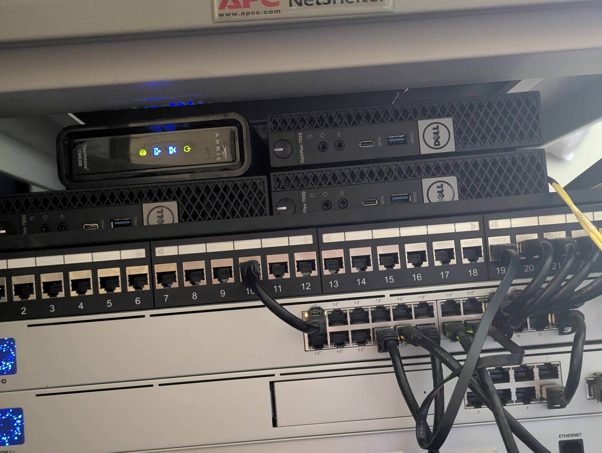

# K3S_Optiplex_Cluster_Project
## Background
Distributed computing systems play a massive role in today's technology industries. Since it's not always feasible to have a singular powerful machine, the ability to utilize many smaller machines and combine the processing power for containerized programs has been made possible thanks to technologies like Kubernetes and Docker Swarm. 

After taking an applied distributed computing course while working on my master's degree in computer science, I wanted to build a distributed compute cluster for myself using affordable equipment such as micro form factor computers such as the Dell Optiplex or Lenovo ThinkCentre.

## Project Plan
I settled on the Dell Optiplex 7050. I was able to get ahold of three devices on eBay that came with 8GB of RAM and a single-threaded 4-core i5-6500T processor I upgraded each to 16GB and storage in the form of a 128GB NVME SSD. Overall, each device cost me about $60 after the upgrades. Forthe load balancer, I decided to use a Raspberry Pi 4 that I had laying around from a previous project. Network-wise, I utilized my Ubiquiti Unifi home network in the form of a Unifi Dream Machine Pro and USW 24 port POW switch. For software, I opted to utilize the lighter weight Rancher K3s Kubernetes variant since I didn’t have a whole lot of computing power to begin with. Despite the fact that the machines were fairly underpowered, I decided to use Proxmox as a hypervisor on each machine instead of installing to bare metal since I knew I would inevitably make break something and I wanted to be able to quickly and remotely spin up a new VM as opposed to having to reinstall the OS at the machines.

### Hardware Overview
3× Dell Optiplex 7050

  * i5-6500T CPU
  * 16GB RAM
  * 128GB NVMe SSD

1× Raspberry Pi 4 (load balancer)




### Software Overview
  * Proxmox VE 8.4
  * Ubuntu Server 24.04.2 LTS AMD64 (for the Optiplex machines)
  * Rancher K3S
  * Ubuntu Server 24.04.2 LTS ARM64 (for RPi4)

## Setup Progress
### Step 1: Prepare the Systems

First, install Ubuntu Server the Dell machines and the RPi4.

For each Dell Optiplex:
1. Download Ubuntu Server
2. Create a bootable USB drive
3. Install Ubuntu Server with minimal options
4. Set static IP addresses for each node

For the Raspberry Pi 4:
1. Download Ubuntu Server for ARM
2. Flash it to an SD card
3. Set a static IP address

### Step 2: Set Up the Load Balancer (RPi4)

Install HAProxy on the RPi4:

```bash
sudo apt update
sudo apt install -y haproxy
```

Configure HAProxy by editing `/etc/haproxy/haproxy.cfg`:

Restart HAProxy:
```bash
sudo systemctl restart haproxy
```

### Step 3: Set Up the First Master Node

On your first Dell Optiplex:

```bash
# Install k3s as the first server node
curl -sfL https://get.k3s.io | sh -s - server \
  --token=YOUR_CLUSTER_TOKEN \
  --tls-san LOAD_BALANCER_IP \
  --node-ip=MASTER_IP_ADDRESS \
  --advertise-address=MASTER_IP_ADDRESS \
  --cluster-init
```

The cluster token was created using open SSL to produce a random 64-character token.

```bash 
openssl rand -hex 32
```

### Step 4: Add the Other Master Nodes
Since uy wanted to he able to experiment with high availability, I decided to set each is the devices as master nodes to ensure that if a device were to go down that the cluster would continue to operate. 

On the second and third Dell Optiplex machines:

```bash
# Install k3s as additional server nodes
curl -sfL https://get.k3s.io | sh -s - server \
  --token=YOUR_CLUSTER_TOKEN \
  --tls-san LOAD_BALANCER_IP \
  --node-ip=NODE_IP_ADDRESS \
  --advertise-address=NODE_IP_ADDRESS \
  --server https://LOAD_BALANCER_IP:6443
```

### Step 5: Verify the Cluster

From any of the master nodes:

```bash
sudo kubectl get nodes
```

You should see all three nodes listed with the "Ready" status.

### Step 6: Configure Storage
Since the goal of this project was to practice using distributed systems, I opted to utilize a distributed storage method using Longhorn to ensure expanded yet resilient storage.

#### 1. Install Longhorn

Apply the Longhorn manifest:

```bash
kubectl apply -f https://raw.githubusercontent.com/longhorn/longhorn/master/deploy/longhorn.yaml
```

#### 2. Wait for Longhorn components to be ready

```bash
kubectl -n longhorn-system get pods -w
```

#### 3. Set Longhorn as the default StorageClass

```bash
kubectl patch storageclass longhorn -p '{"metadata": {"annotations":{"storageclass.kubernetes.io/is-default-class":"true"}}}'
```

#### 4. Verify the default StorageClass

```bash
kubectl get storageclass
```

You should see `longhorn` marked as `(default)`.

### Step 7: Install kubectl on Your Workstation

To manage the cluster from your workstation:

#### 1. Install kubectl
```bash
curl -LO "https://dl.k8s.io/release/$(curl -s https://dl.k8s.io/release/stable.txt)/bin/linux/amd64/kubectl"
```

#### 2. Make it Executable
```bash 
chmod +x kubectl
```

#### 3. Move to PATH
```bash
sudo mv kubectl /usr/local/bin/
```

#### 4. Verify
```bash
kubectl version --client
```

#### 5. Copy the config from a master node:
```bash
scp USER@MASTER_IP_ADDRESS:/etc/rancher/k3s/k3s.yaml ~/.kube/config
```

#### 6. Edit the config to use the load balancer's IP:
```bash
sed -i 's/127.0.0.1/LOAD_BALANCER_IP/g' ~/.kube/config
```

### Step 8: Set Up Monitoring (Optional)
Since k3s is a significantly lighter version of k8s, it does not come with any monitoring out of the box. Therefore, of we want monitoring, we have to add it separately. 

Deploy Prometheus and Grafana for monitoring:

Since we may not always have our laptop on the network, it would be a good idea to use the RPI4 load balancer as a means for hosting the monitoring pages. To accomplish this we're going to utilize MetalLB.

#### 1. Install MetalLB
Visit the MetalLB GitHub releases page to find the latest version and install accordingly 

```bash
kubectl apply -f https://raw.githubusercontent.com/metallb/metallb/<latest_version>/manifests/metallb.yaml
```

Configure MetalLB Address Pool and Apply
Configure metallb-config.yaml

```bash
kubectl apply -f metallb-config.yaml
```

Veify the IP-pool
```bash
kubectl get ipaddresspool -n metallb-system
```

#### 2. Install the Kube-Prometheus Stack via Helm 

```bash
helm install prometheus prometheus-community/kube-prometheus-stack \
  --namespace monitoring \
  --set prometheus.prometheusSpec.serviceMonitorSelectorNilUsesHelmValues=false \
  --set prometheus.prometheusSpec.podMonitorSelectorNilUsesHelmValues=false
```

After installing, verify by checking services

```bash
kubectl get SVC -n monitoring
```

You should see EXTERNAL-IP from the pool range on Grafana and Prometheus. If not, fix them with the following: 

```bash
kubectl patch svc prometheus-new-grafana -n monitoring --type='json' -p '[{"op": "replace", "path": "/spec/type", "value": "LoadBalancer"}]'
kubectl patch svc prometheus-new-kube-promet-prometheus -n monitoring --type='json' -p '[{"op": "replace", "path": "/spec/type", "value": "LoadBalancer"}]'
```

Finally, obtain the Grafana password using:
```bash
kubectl get secret prometheus-grafana -n monitoring -o jsonpath="{.data.admin-password}" | base64 --decode
```

By default, the user name is 'admin'

## Next Steps
  * Add Terraform and Ansible automation
  * Implement system and metric tests to determine cluster efficiency
  * Find more ways to learn and work with Kubernetes
